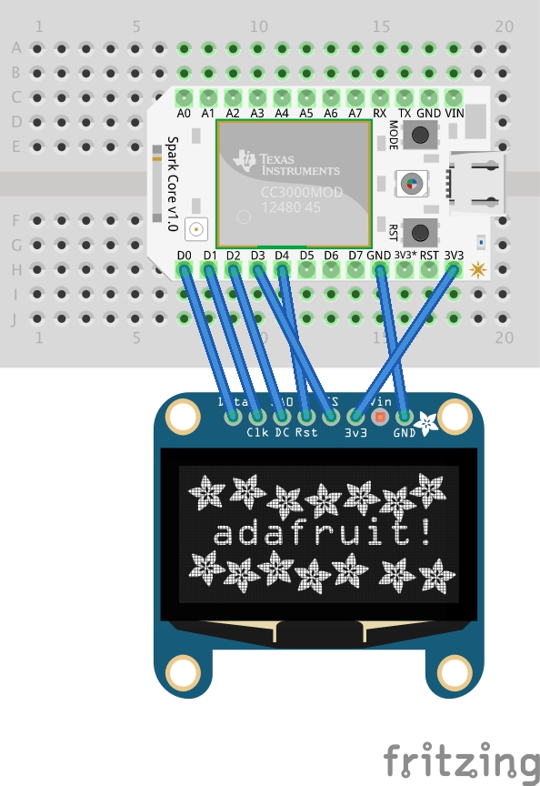

Adafruit_SSD1306
================

Adafruit_SSD1306 library ported for Spark by Paul Kourany, Mar 18, 2014

SSD1306 128x64 Wiring guide 

// If using software SPI (the default case):
#define OLED_MOSI   D0
#define OLED_CLK    D1
#define OLED_DC     D2
#define OLED_CS     D3
#define OLED_RESET  D4
Adafruit_SSD1306 display(OLED_MOSI, OLED_CLK, OLED_DC, OLED_RESET, OLED_CS);

